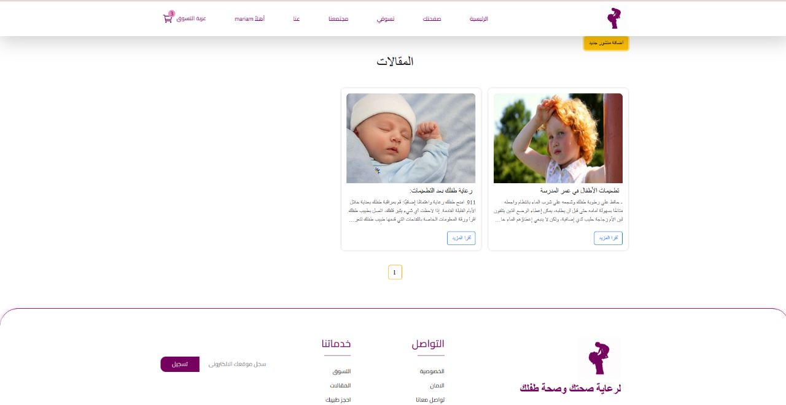
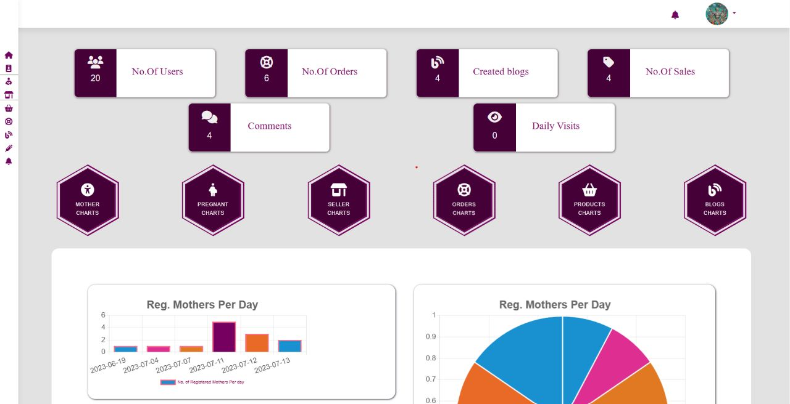

# 👩‍👧 Mommy

it is a website and mobile application that serves mothers, especially pregnant women, by knowing all the vaccinations or medical advice they need


---

## 🖼️ Screenshots




> To add images, place them in a `docs/` folder and link them using Markdown like this:
> ``

---

## 🔍 Features

- 📝 Create, update, and delete baby stuf
- 👩‍👧 Role-based access (e.g. Admin, Parent, Child)
- 🔔 Notifications and reminders
- 📊 Task status overview (e.g. completed, pending)

---

## ⚙️ Tech Stack

- **Backend**: Node.js, Express.js
- **Frontend**: React.js , Angular
- **Database**: MongoDB 
- **Authentication**: JWT 
- **Others**: Bootstrap, Axios, etc.

---

## 🚀 Getting Started

### Prerequisites

- Node.js
- npm or yarn
- MongoDB or other DB

### Installation

```bash
git clone https://github.com/HagarGamal0/mommy.git
cd mommy
npm install
